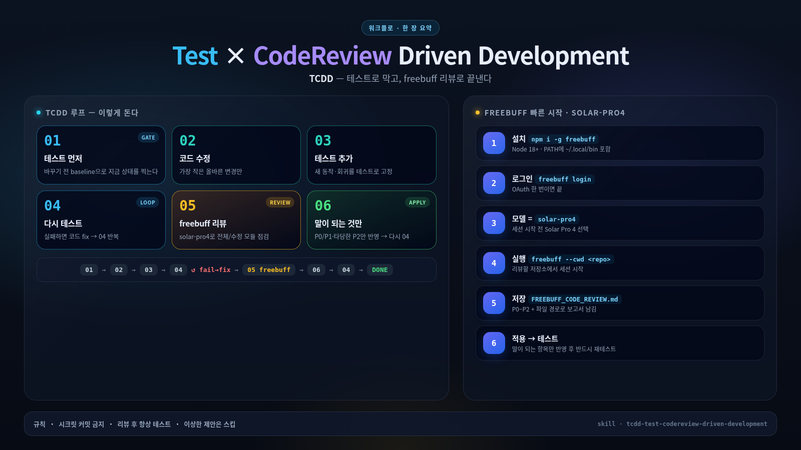

# TCDD — Test × CodeReview Driven Development

**TCDD** is a mandatory loop for every non-trivial code change.

**Tests gate code changes. Solar Pro 4 review gates DONE.**



## Agent skill

Use [`SKILL.md`](./SKILL.md) as the agent skill. It is written so an AI can execute the loop without guessing:

1. Baseline tests  
2. Smallest correct code change  
3. Add/update tests  
4. Tests green  
5. Freebuff / **Solar Pro 4** review → `FREEBUFF_CODE_REVIEW.md`  
6. Verify findings against real code  
7. Apply sensible findings  
8. Re-test (and re-review if code changed)  

**DONE** only when latest tests are green **and** a current-batch Solar Pro 4 Freebuff review is complete.

## Install Freebuff

```bash
npm install -g freebuff
freebuff login
freebuff --cwd <repo>
# select solar-pro4 / upstage/solar-pro4
```

## License

MIT
